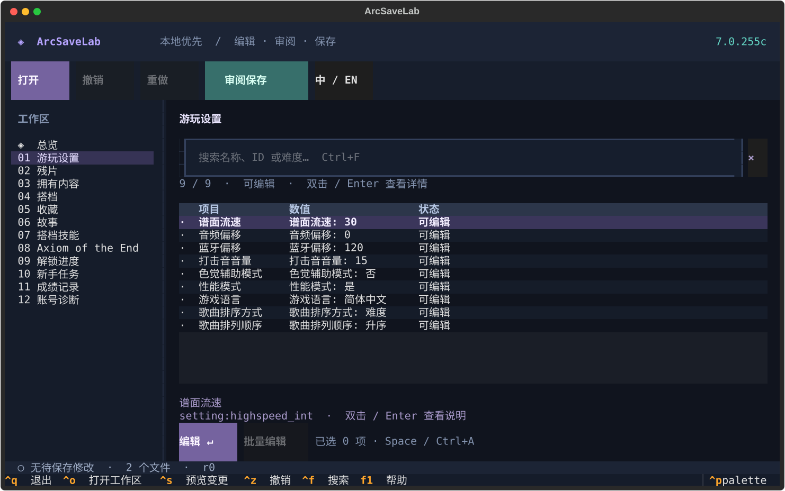

# ◈ ArcSaveLab

**Your save, under control.** A local-first Arcaea save manager for your terminal.

English · [简体中文](README_CN.md)



## A workspace, not a maze of prompts

- Folder detection, a keyboard-accessible file browser, and independent selection of all four save components.
- Searchable categories, stable row selection, isolated edit forms, and explicit field opt-in for batch edits.
- Undo / redo, before-and-after review, and export to a **new** folder by default.
- Optional in-place save with mandatory backups; backup history and verified, reversible restoration.
- English / Simplified Chinese UI, mouse support, command palette, and compact terminal layout.
- Lossless XML updates, shadow SQLite writes, external-change checks and transaction journals.

## Run from source

Requires Python **3.12+** and a UTF-8 terminal (80×24 minimum; 120×36 recommended).

```console
uv sync --locked
uv run arcsavelab
```

Open a folder or select components explicitly:

```console
uv run arcsavelab edit ./saves --language en
uv run arcsavelab edit --preferences ./saves/Cocos2dxPrefsFile.xml --scores ./saves/st3
```

For a persistent installation from a checkout or a downloaded wheel:

```console
uv tool install .
arcsavelab
```

`python -m pip install .` is also supported. The project does not depend on an APK, ADB,
an installed game, a sibling checkout, or a particular user's home directory at runtime.

## Supported data

| Component | Typical filename | Editing |
| --- | --- | --- |
| Settings and local progress | `Cocos2dxPrefsFile.xml` | Settings, fragments, favorites, partners, story and known counters |
| Scores and clear types | `st3` | Judgements, derived scores, clear types, Full Recall / Pure Memory presets |
| Unlock progress | `un` | Requires preferences to store the companion digest |
| Missions | `ms` | Requires preferences to store the companion digest |

Latest supported version: **7.0.255c**. The bundled catalog contains 553 song records (552 live), 1,833 charts,
62 packs and 100 partners. It includes official Partner names and skill descriptions,
but no music, artwork, story scripts or complete game translation message catalog. Unknown XML nodes and SQLite schema
objects are retained. Finale/account diagnostics are read-only. Device-bound fields
require a session-only device identity; no network login or cloud synchronization is performed.

Compatibility has separate layers: catalog metadata, save structure, and actual in-game
behavior. See [formats and validation status](docs/formats.md); a successful file round-trip
is not an in-game import test.

## Everyday workflow

1. **Open** (`Ctrl+O`) a folder, or browse/select files individually.
2. Choose a category. **Search** (`Ctrl+F`) by name, ID, or difficulty.
3. **Double-click or press Enter** for explanations and editing. Single-click only selects. Validation keeps the draft open on failure. `Esc` cancels it.
4. On the table, **Space** marks a row; `Ctrl+A` toggles all filtered rows. `Ctrl+B` opens a
   batch form, where each field must be explicitly enabled before it affects multiple rows.
5. **Review** (`Ctrl+S`) all pending changes. Export to a new directory, or explicitly
   confirm in-place replacement. A successful save switches the workspace to the saved files.

`Ctrl+Z` / `Ctrl+Y`: undo / redo. `Ctrl+I`: device identity. `Ctrl+R`: digest repair.
`Ctrl+H`: backup history. `F1`: help. `Ctrl+Q`: quit with a dirty-session confirmation.
See [device identity acquisition](docs/device-identity.md) before entering a device ID.
Drag a table header separator `│` to resize that column; widths last for the app session.
Yes/no values use green/red, and missing identity or source uses amber. Account values remain
hidden in the list and are shown only in read-only details (avoid sharing token screenshots).
Axiom details show raw `fin_v` and indexed entries; the trailing marker is not full validation.
Shortcuts inside text inputs follow the input widget's editing behavior; the toolbar remains available.

Close the game or other save-writing tools before editing. SQLite files with a non-empty
WAL/rollback journal are rejected instead of silently losing journaled rows. Keep an independent
copy of important saves. Recovery and stale-lock handling are documented in
[transactions](docs/architecture.md#transactions).

## CLI utilities

```console
arcsavelab verify ./saves/Cocos2dxPrefsFile.xml --un ./saves/un --ms ./saves/ms --format json
arcsavelab catalog info
arcsavelab catalog verify
arcsavelab catalog build --apk ./game.apk --version GAME_VERSION --out ./catalog-output
```

Use `arcsavelab verify --help` for strict verification and identity options. Build output is
explicit; rebuilding a catalog does not silently replace the bundled profile.

## Development

```console
uv sync --locked
uv run pytest
uv run ruff check .
uv run ruff format --check .
uv run mypy
uv build
uv run python scripts/check_distribution.py dist
uv run python scripts/smoke_wheel.py dist
```

Tests construct their own synthetic files. Personal samples and earlier checkouts stay ignored
and are excluded by an explicit distribution allowlist. See [contributing](CONTRIBUTING.md)
and the [rewrite decisions](docs/architecture.md).

ArcSaveLab is an independent, unofficial project and is not affiliated with lowiro.
Code is licensed under [MIT](LICENSE). Arcaea and associated game metadata belong to their
respective owners. Development was AI-assisted.
